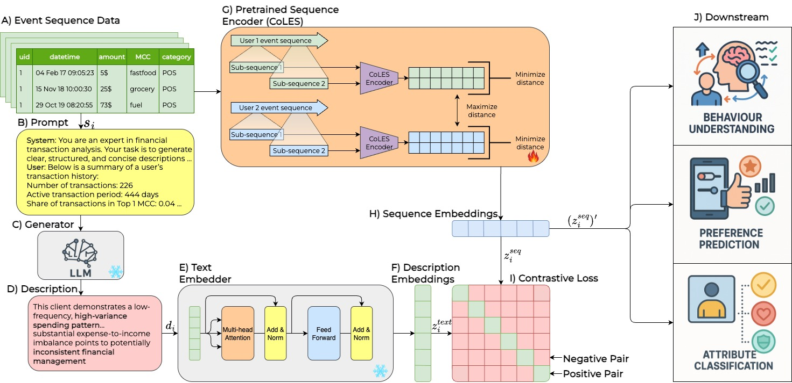

# LATTE: Learning Aligned Transactions and Textual Embeddings for Bank Clients
<p align="center">
  
</p>

## Overall
Learning clients embeddings from sequences
of their historic communications is central to
financial applications. While large language
models (LLMs) offer general world knowledge,
their direct use on long event sequences is computationally expensive and impractical in realworld pipelines. In this paper, we proposeLATTE, a contrastive learning framework that
aligns raw event embeddings with descriptionbased semantic embeddings from frozen LLMs.
Behavioral features based on statistical user descriptions are summarized into short prompts,
embedded by the LLM, and used as supervision
via contrastive loss. The proposed approach
significantly reduces inference cost and input
size compared to the conventional processing
of complete sequences by LLM. We experimentally show that our method outperforms
state-of-the-art techniques for learning event sequence representations on real-world financial
datasets while remaining deployable in latencysensitive environments.


## usage
### environment setup (without Docker)
```sh

git clone https://github.com/tsebaka/LATTE.git
cd LATTE
cd source

# llm-foundry env
git clone https://github.com/mosaicml/llm-foundry.git
cd llm-foundry
python3 -m venv llmfoundry-venv
source llmfoundry-venv/bin/activate
pip install cmake packaging torch
pip install -e ".[gpu]"
pip install deepspeed=0.15.4
cd ..

# ptls env
git clone https://github.com/pytorch-lifestream/ptls-experiments.git
cd ptls-experiments
python3 -m venv ptls-venv
source ptls-venv/bin/activate
pip install pytorch-lifestream
cd ..
```


### llm-foundry training

1. Generate descriptions and inference them:
```sh
bash run.sh
```
2. Generate statisctics
```sh
# for rosbank dataset
run notebooks/scenario_rosbank.ipynb
```
